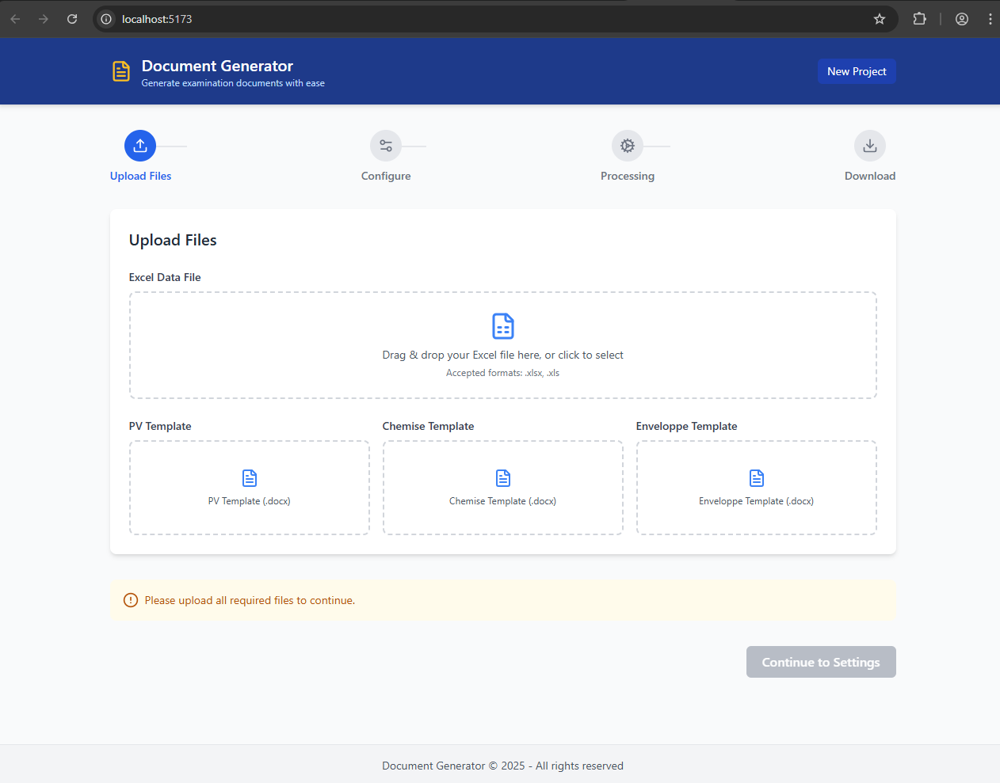

# Exam Document Generator



An automated system for generating exam-related documents (reports, folders, and envelopes) from Excel data using Word templates.

## Features

- 📊 Parse exam schedules from Excel files
- 📝 Generate three types of documents:
  - Exam reports (PVs)
  - Exam folders (Chemises)
  - Exam envelopes
- 🖇️ Merge individual documents into consolidated files
- 🎨 Customizable templates for each document type
- ⚡ Fast batch processing

## Installation

1. Clone the repository:
   ```bash
   git clone https://github.com/SanicYassir/Docgenwork.git
   cd Docgenwork
   npm install

2. npm run dev